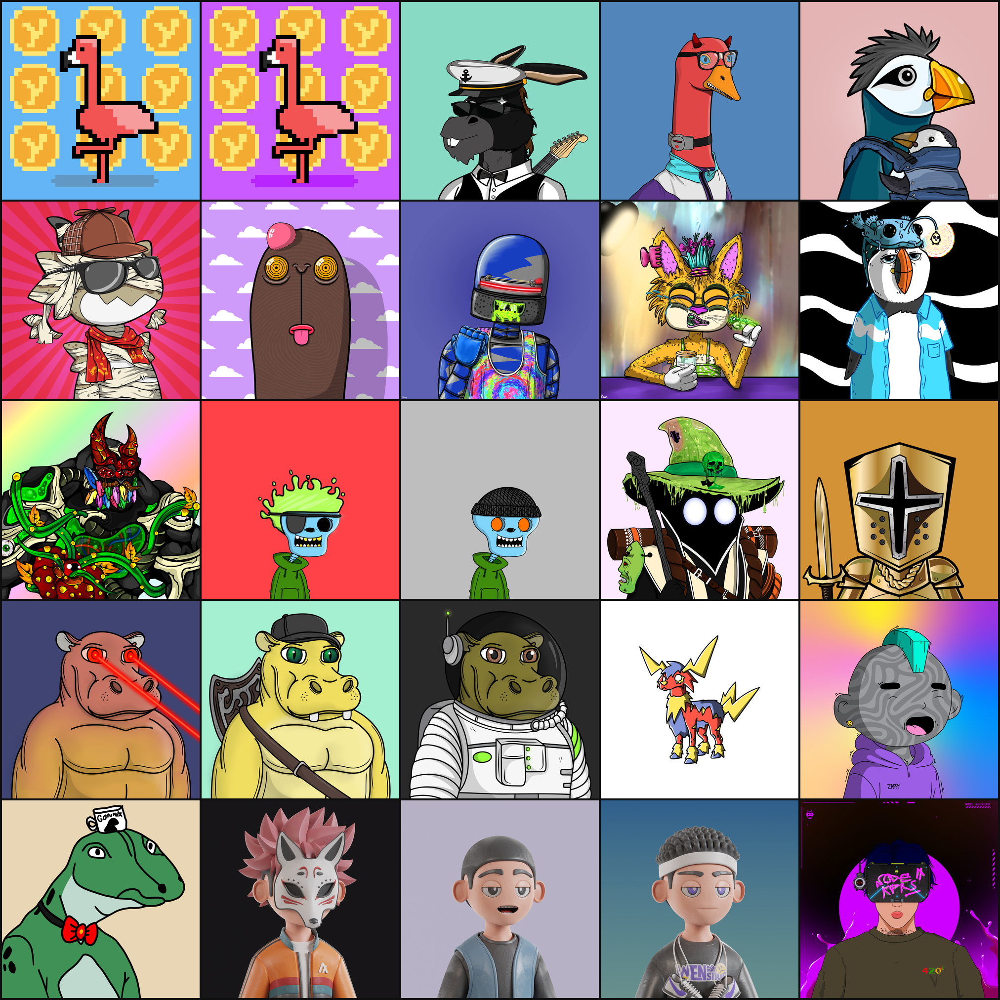

# algo-nft-grid

Generate a square NFT wall image from any Algorand wallet address or NFD.



---

## Quick start (for dummies 🐣)

Never used Python before? No problem. Follow these steps once and you're done.

### Step 1 — Check you have Python 3

Open your terminal and type:

```bash
python3 --version
```

You should see something like `Python 3.10.x` or higher. If not, download it from [python.org](https://www.python.org/downloads/).

### Step 2 — Download the script

```bash
git clone https://github.com/filippofalleroni/algorand-nft-grid.git
cd algorand-nft-grid
```

No Git? [Download the ZIP](https://github.com/filippofalleroni/algorand-nft-grid/archive/refs/heads/main.zip) from GitHub, unzip it, and open the folder in your terminal.

### Step 3 — Create a virtual environment

This keeps the required packages isolated from your system Python (required on macOS with Homebrew):

```bash
python3 -m venv venv
source venv/bin/activate        # macOS / Linux
# venv\Scripts\activate         # Windows
```

You'll see `(venv)` appear at the start of your terminal prompt. Good.

### Step 4 — Install dependencies

```bash
pip install -r requirements.txt
```

### Step 5 — Run it

```bash
python3 nft_grid.py famverse.algo
```

The script will:
1. Resolve the NFD to an Algorand address
2. Scan the wallet for NFTs
3. Show you a menu to pick the grid size (2×2 up to 10×10)
4. Download the images and save a PNG in the current folder

---

## Next time you open the terminal

Just activate the virtual environment again before running the script:

```bash
cd algorand-nft-grid
source venv/bin/activate        # macOS / Linux
# venv\Scripts\activate         # Windows
python3 nft_grid.py your-nfd.algo
```

---

## Usage

```bash
python3 nft_grid.py <address_or_nfd> [options]
```

### Examples

```bash
# Interactive grid picker (recommended)
python3 nft_grid.py famverse.algo

# Skip the menu and set size directly
python3 nft_grid.py famverse.algo --size 5

# Raw Algorand address
python3 nft_grid.py RWBL6NFN53EH5X3U7LNZW73HNJY5UCSLB2MCCYU2FEX76HEVWTFGBXNYMQ

# Custom cell size and output file
python3 nft_grid.py pippo.algo --size 4 --cell 600 --out my_wall.png
```

### Options

| Option | Default | Description |
|--------|---------|-------------|
| `--size N` | interactive | Grid side length (N×N NFTs). If omitted, shows a menu. |
| `--cell PX` | `500` | Cell size in pixels |
| `--gap PX` | `4` | Gap between cells in pixels |
| `--out FILE` | `nft_grid.png` | Output filename |
| `--delay SEC` | `0.3` | Delay between IPFS requests |

---

## How it works

1. **Resolve the address** — if the input ends in `.algo`, it's resolved via the [NFD API](https://api.nf.domains).
2. **Fetch wallet assets** — via the [Algonode](https://algonode.io) mainnet API.
3. **Filter NFTs** — assets with `total ≤ 100` and `decimals == 0` are treated as NFTs; fungible tokens are skipped.
4. **Resolve images** — handles all three main Algorand NFT standards:
   - **ARC-3**: metadata JSON on IPFS → `image` field
   - **ARC-19**: CID derived from the `reserve` address → metadata JSON → image
   - **ARC-69**: image URL stored directly in the ASA `url` parameter
5. **Download & compose** — images are fetched with gateway fallback, resized, and arranged in an N×N grid.

---

## Supported ARC standards

| Standard | Method | Notes |
|----------|--------|-------|
| ARC-3 | `ipfs://CID#arc3` or `https://ipfs.io/ipfs/CID` | Fetches JSON metadata |
| ARC-19 | `template-ipfs://{ipfscid:0\|1:…:reserve:sha2-256}` | Derives CID from reserve address |
| ARC-69 | Direct URL in ASA params | Image URL used as-is |

---

## IPFS Gateways

The script tries these gateways in order, stopping at the first successful response:

1. `https://ipfs.io/ipfs/`
2. `https://dweb.link/ipfs/`
3. `https://nftstorage.link/ipfs/`
4. `https://w3s.link/ipfs/`
5. `https://gateway.pinata.cloud/ipfs/`

---

## Requirements

```
Python 3.10+
Pillow
requests
base58
```

---

## Contributing

PRs welcome. Ideas for improvement:

- [ ] `--label` flag to overlay NFT names on each cell
- [ ] `--exclude ASA_ID` to skip specific assets
- [ ] Multi-page PDF output for large collections
- [ ] Optional Vestige / Allo metadata fallback

---

## License

MIT
